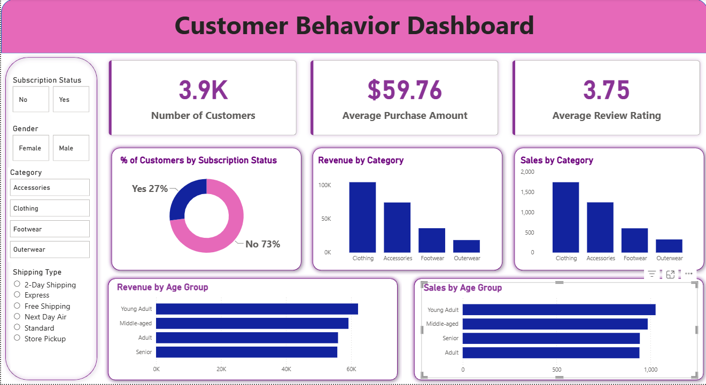

# 🛍️ Customer Shopping Behavior Analysis

## End-to-End Data Analytics Project

**Python | SQL | PostgreSQL | Power BI | Data Visualization**

---

## 📊 Power BI Dashboard



---

## 📌 Executive Summary

Customer Shopping Behavior Analysis is an end-to-end data analytics project focused on understanding customer purchasing patterns, spending behavior, product preferences, subscription behavior, customer loyalty, and shopping trends.

The project analyzes a dataset containing **3,900 customer purchase transactions across 18 columns**.

The complete analytics workflow includes:

- Data cleaning and preparation using Python
- Exploratory Data Analysis
- Feature engineering
- PostgreSQL database integration
- Business analysis using SQL
- Interactive Power BI dashboard
- Customer segmentation
- Business insights
- Strategic recommendations

The primary objective is to transform raw customer transaction data into meaningful business insights that can support data-driven decisions related to marketing, customer retention, product positioning, subscriptions, and customer engagement.

---

# 🎯 1. Business Problem

A retail company wants to better understand its customers' shopping behavior in order to improve:

- Sales performance
- Customer satisfaction
- Customer engagement
- Customer retention
- Customer loyalty
- Marketing strategies
- Product positioning

### Business Question

> **How can the company leverage customer shopping data to identify trends, improve customer engagement, and optimize marketing and product strategies?**

---

# 🎯 2. Project Objectives

1. Analyze customer purchasing behavior.
2. Understand customer spending patterns.
3. Analyze revenue across different customer segments.
4. Identify high-performing product categories.
5. Identify top-performing products.
6. Analyze customer subscription behavior.
7. Analyze discount usage and purchasing behavior.
8. Compare shipping types and purchase amounts.
9. Segment customers based on previous purchase behavior.
10. Analyze revenue contribution by age group.
11. Build an interactive Power BI dashboard.
12. Generate actionable business recommendations.

---

# 📊 3. Dataset Overview

| Dataset Metric | Value |
|---|---:|
| Total Transactions | 3,900 |
| Total Columns | 18 |
| Missing Values | 37 |
| Missing Data | Review Rating |

### Customer Information

- Customer ID
- Age
- Gender
- Location
- Subscription Status

### Purchase Information

- Item Purchased
- Category
- Purchase Amount
- Season
- Size
- Color

### Shopping Behavior

- Discount Applied
- Promo Code Used
- Previous Purchases
- Frequency of Purchases
- Review Rating
- Shipping Type

---

# 🔄 4. Project Workflow

```text
Raw Customer Data
        ↓
Data Cleaning & Preparation
        ↓
Exploratory Data Analysis
        ↓
Feature Engineering
        ↓
PostgreSQL Database
        ↓
SQL Business Analysis
        ↓
Power BI Dashboard
        ↓
Business Insights
        ↓
Business Recommendations
